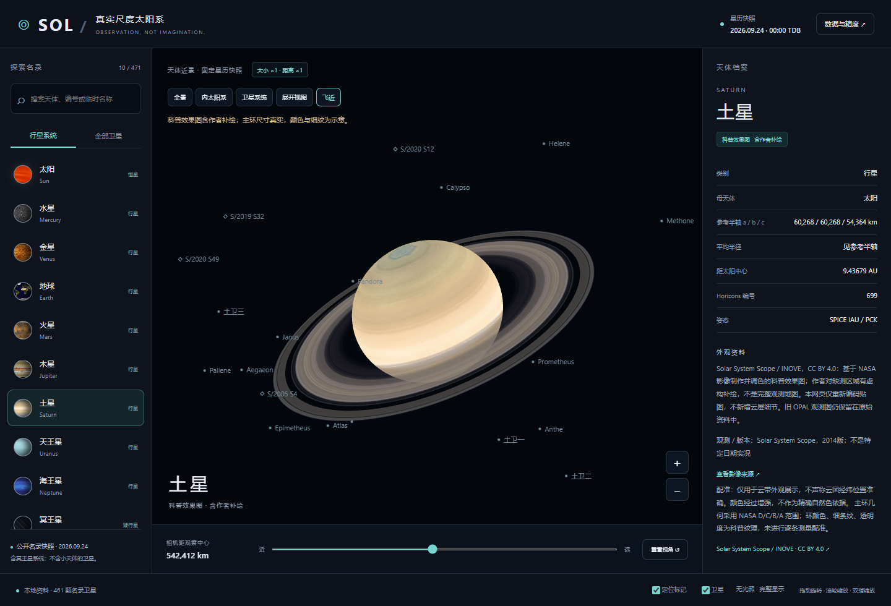

# OpenSolar Atlas

A source-attributed 3D model library built with Vue 3 and native Three.js.
The solar system is the first implemented subject. Open a shared workbench,
explore a model, and inspect where its geometry and appearance came from.
Independent subjects can be contributed without changing the app shell.

**[Live preview — atlas.fancivision.com](https://atlas.fancivision.com/)**

[中文说明](README.zh-CN.md) · [Data methods](docs/DATA.md) · [Asset credits](THIRD_PARTY.md)

[Add a 3D model](docs/ADDING_A_MODEL.md) · [Architecture](docs/ARCHITECTURE.md)



## What works

- Model library, subject search/filter, contributor guide and a responsive shared workbench.
- Runnable module starter: `npm run create:model -- my-structure`. See the [integration guide](docs/ADDING_A_MODEL.md).
- Independent human anatomy module: male BodyParts3D / female HRA sample switching,
  sourced skeletal, vascular and partial neural layers, and an internal head cutaway.
  Female skeletal coverage is incomplete; approximate traditional meridians are
  available only on the male reference. [Coverage and sources](src/modules/human-anatomy/README.md).
- One kilometre per world unit for both body axes and positions; no planet enlargement.
- Searchable snapshot of 471 bodies, including 461 planetary/Pluto satellites.
- Drag, wheel/pinch zoom, fly-to, system views and mobile side panels.
- Offline base mode; optional NASA GIBS detail loads online without a login or API key.
- Per-body provenance, raw JPL responses and explicit missing-data states.
- Visible distinction between observation-based maps, artistic reconstruction and placeholders.
- Vue 3 UI with a native Three.js scene, initialized on mount and disposed on unmount.
- English by default; Simplified Chinese, Traditional Chinese, Japanese and Korean.
- 471 individual evidence panels, 460 discovery records, 55 physical-parameter tables
  and 32 source-linked NASA background summaries, available in all five languages.
- Earth geography: 242 country/region records and 7,342 selected populated places
  from Natural Earth v5.1.2, with boundaries, multilingual search and globe location.

## Run

Use Node.js 20 or newer and a modern WebGL browser:

```sh
npm ci
npm run dev
```

Visit the local URL printed by Vite. For a production preview, run
`npm run build` followed by `npm run preview`. Deploy the contents of `dist/` to
any static HTTP server, including a GitHub Pages project subdirectory. Opening
the source `index.html` directly with `file://` is no longer supported.

After installation/build, the served application works with local base imagery
without an Internet connection. **Detailed imagery** is on by default and loads
NASA GIBS tiles for the current Earth view; turn it off for fully offline use.
Unavailable tiles fall back to cached/local imagery. External links also require Internet access. Language
selection is remembered locally. A link such as `?lang=ja&body=699` opens Saturn
in Japanese. Source titles, formal catalogue names without reviewed translations,
and explicitly labelled original annotations retain their original language.

The root URL opens the model library. Use `?model=solar-system` for the workbench
or `?view=guide` for the contributor guide. Older `?body=...` links still work.

## Verify and deploy

```sh
npm ci
npm test
npx playwright install chromium
npm run test:browser
npm run test:shell
npm run test:anatomy
npm run test:earth
npm run build
npm run test:production
```

The build compiles Vue and copies an explicit runtime/provenance allowlist to `dist/`.
Browser checks cover five languages, mobile layouts, scene disposal/remounting,
true-scale geometry and a production site served below `/opensolar-atlas/`. On GitHub,
set Settings → Pages → Source to GitHub Actions. The included workflow validates
the data and browser before deploying pushes to `main`. Pull requests run checks
without deployment. No API credentials are required.

## Scientific boundaries

This is an educational visualization, not a navigation or research-grade model.
The frozen epoch is **2026-09-24 00:00:00 TDB**. The catalogue covers JPL planetary
and Pluto satellites plus the Moon, not all minor-planet satellites. There are
469 available positions, 81 known reference dimensions and 80 rendered bodies;
the rest are explicitly incomplete. Surface elevations and orbital animation
are not implemented. Labels are screen aids, not true-scale objects.

Original maps have different epochs, bands and processing histories. Saturn,
Uranus and Neptune use credited illustrations with artist-filled gaps, not full
observed globes. The Sun uses an EUV false-colour panorama. Most older maps lack
verified longitude registration. Illumination is disabled; historical image
shading may remain. Ring colours and fine details are illustrative.

Descriptions are our attributed summaries/translations of NASA material, not
official NASA translations or an exhaustive encyclopaedia. Less-documented
satellites receive their individual JPL discovery/physical records and explicit
limits on available information; missing geology or appearance is not invented.
Physical-table values retain source precision, units, uncertainty and reference
codes. These reference parameters are separate from the fixed-epoch scene state.

Earth's geographic panel appears when Earth is selected. Search a city or switch
to countries/regions, choose a result to locate it, or click a visible place label
on the globe. Boundaries and city labels have separate switches; more city labels
appear at closer zoom. On phones, open **Object profile** to use the place search.
Natural Earth is an independent public-domain cartographic dataset: its records
include territories, its city selection is not exhaustive, and boundaries follow
its documented de facto policy. The frozen layer is not a current official
national map. It does not add street imagery, buildings or elevation geometry.
Online detail uses the NASA Blue Marble August 2004 shaded-relief/bathymetry
composite, up to approximately 500 m source resolution. It improves regional
zoom without inventing details. The original 2048-pixel globe is retained as an
offline fallback; it becomes blurry at close zoom. See [Earth imagery](docs/EARTH.md).

## Provenance and development

- [JPL satellite catalogue](https://ssd.jpl.nasa.gov/sats/discovery.html)
- [Horizons](https://ssd-api.jpl.nasa.gov/doc/horizons.html)
- [NAIF kernels](https://naif.jpl.nasa.gov/pub/naif/generic_kernels/pck/)
- [NASA SVS](https://svs.gsfc.nasa.gov/), [Hubble OPAL](https://archive.stsci.edu/hlsp/opal)
- [Solar System Scope](https://www.solarsystemscope.com/textures/)

See `data/asset-manifest.json` for checksums and `docs/DATA.md` for rebuilding.
See [architecture](docs/ARCHITECTURE.md) for module and localization boundaries.
The human anatomy subject follows the same module contract. Its neural coverage
is partial and its meridians are approximate diagrams, not measured anatomy.
No clinical features are provided.
Development is AI-assisted using Codex. Scientific review and corrections are
welcome; generated code is not evidence of scientific accuracy.

This is an early project. We do not claim established adoption, institutional
endorsement, or a history of third-party maintenance. Near-term priorities are
better map registration, accessible controls and independently reviewed data.
The [open-source readiness notes](docs/OPEN_SOURCE.md) distinguish engineering
work from Codex for OSS eligibility. Application and publication are paused.

## License

Original code and documentation: MIT. Imagery, datasets, Vue and Three.js retain their
own terms; see [THIRD_PARTY.md](THIRD_PARTY.md). The code license does not relicense
third-party assets or imply endorsement by their creators.
